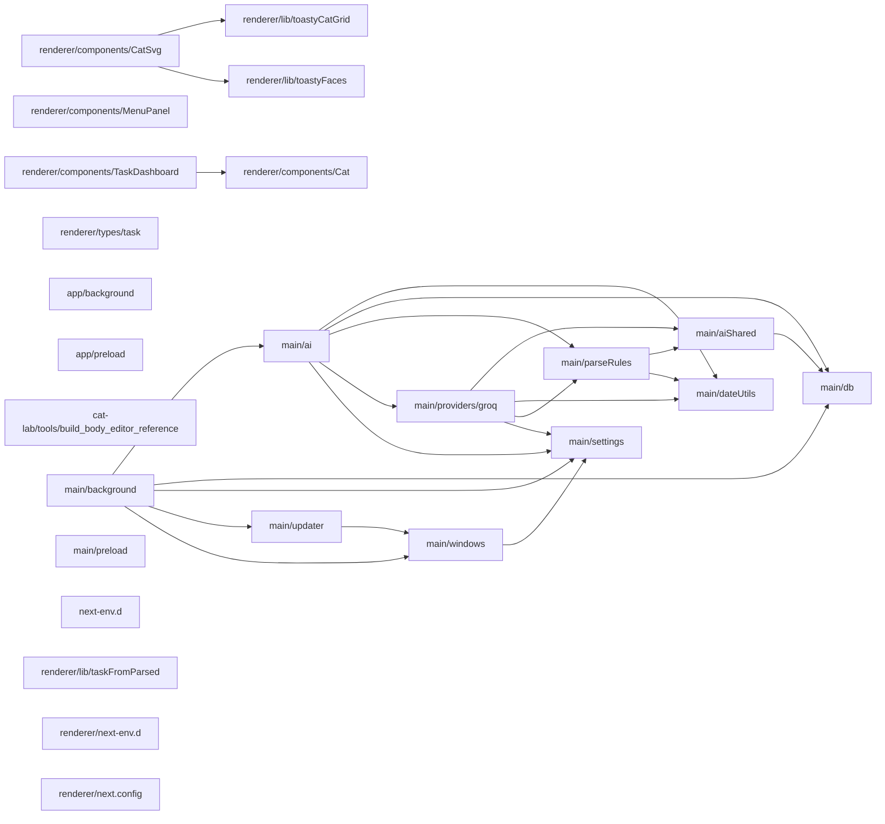

# toasty

**Shape:** nextjs &middot; **Signals:** nextjs

**Status:** CLAUDE.md found, no phase/step markers in it

**Routes:** 0 (0 pages, 0 api)
**Tables:** 0
**Services:** Supabase

_Generated by projmap - do not edit by hand. Full detail: `docs/map/map.json`._

Code structure

| Path | Lang | Fan-in | Fan-out |
|---|---|---|---|
| main/settings | ts | 4 | 0 |
| main/dateUtils | ts | 3 | 0 |
| main/db | ts | 3 | 0 |
| main/aiShared | ts | 2 | 1 |
| main/parseRules | ts | 2 | 2 |
| main/windows | ts | 2 | 1 |
| renderer/lib/toastyFaces | ts | 2 | 0 |
| main/ai | ts | 1 | 5 |
| main/providers/groq | ts | 1 | 4 |
| main/updater | ts | 1 | 1 |
| renderer/components/Cat | tsx | 1 | 0 |
| renderer/components/CatSvg | tsx | 1 | 2 |
| renderer/components/MenuPanel | tsx | 1 | 0 |
| renderer/components/TaskDashboard | tsx | 1 | 1 |
| renderer/lib/toastyCatGrid | ts | 1 | 0 |
| renderer/types/task | ts | 1 | 0 |
| app/background | js | 0 | 0 |
| app/preload | js | 0 | 0 |
| cat-lab/tools/build_body_editor_reference | py | 0 | 0 |
| main/background | ts | 0 | 5 |
| main/preload | ts | 0 | 0 |
| next-env.d | ts | 0 | 0 |
| renderer/lib/taskFromParsed | ts | 0 | 0 |
| renderer/next-env.d | ts | 0 | 0 |
| renderer/next.config | js | 0 | 0 |

_9 more modules omitted - see `map.json`._

Data model

_no tables found_

Routes

_no App Router detected (no `app/` or `src/app/`)_

Process flow

_no key routes found (a route must reference a table by name, e.g. `.from('table')`, to appear here)_

Design & UI

**Tailwind:** - &middot; **Config:** -

**Fonts:** -

**Components:** 4 found
- `renderer/components/Cat.tsx`
- `renderer/components/CatSvg.tsx`
- `renderer/components/MenuPanel.tsx`
- `renderer/components/TaskDashboard.tsx`

Services & env

| Service | Via |
|---|---|
| Supabase | env |

| Env var |
|---|
| `NODE_ENV` |
| `OLLAMA_URL` |
| `SUPABASE_KEY` |
| `SUPABASE_TABLE` |
| `SUPABASE_URL` |
| `example` |

Build state

**Decisions on file:** 1
- `context/decisions/2026-06-17-toasty-chat-window-approach.md`

**TODO/FIXME markers:** 8

Cross-project

_status: pending - computed at the portfolio root; see Phase 5_

