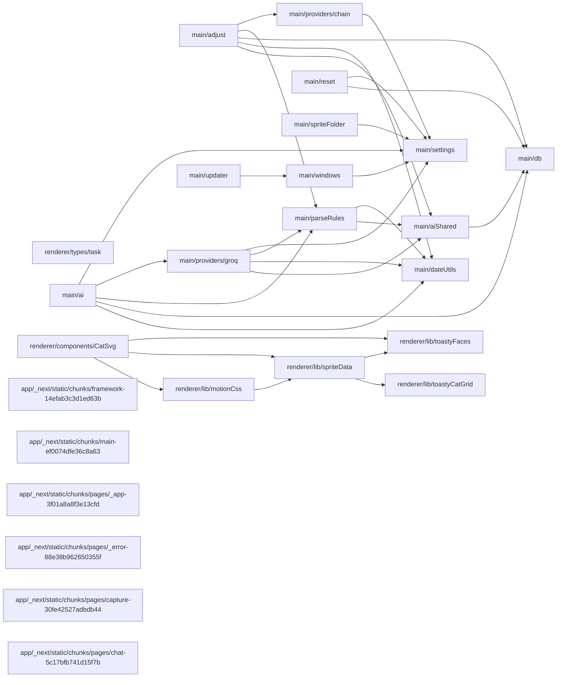
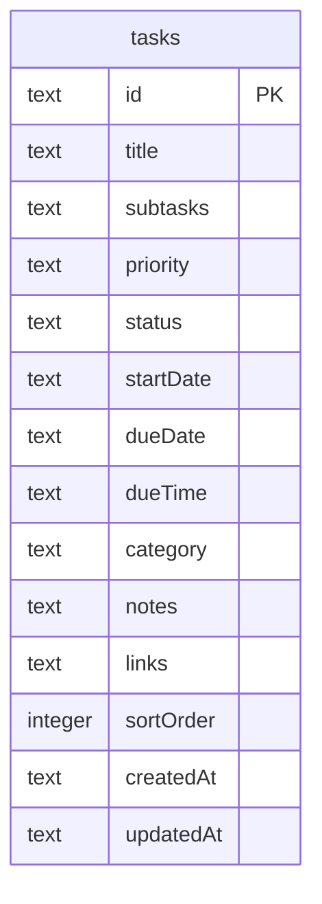
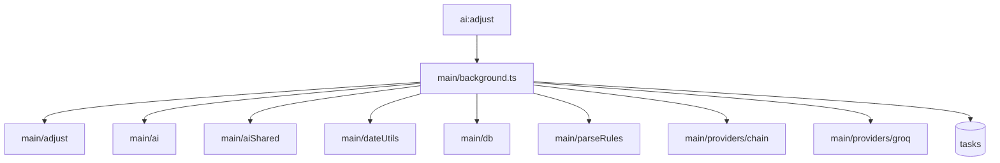
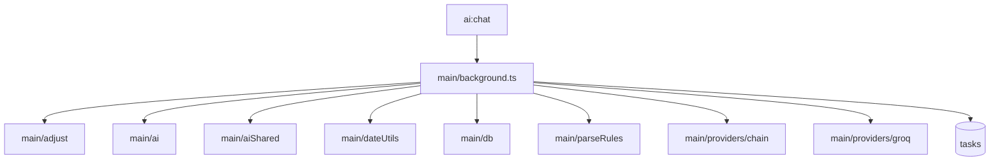
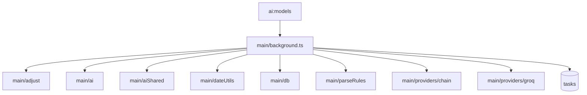
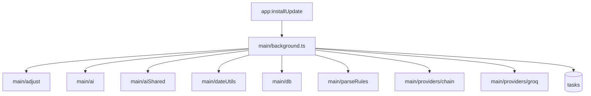

# toasty

**Shape:** electron &middot; **Signals:** electron, nextjs

**Status:** CLAUDE.md found, not phase-structured - carries 1 decision on file

**IPC channels:** 38
**Tables:** 1
**Services:** Electron (desktop shell)

_Generated by projmap - do not edit by hand. Full detail: `docs/map/map.json`._

Code structure

| Path | Lang | Fan-in | Fan-out |
|---|---|---|---|
| main/settings | ts | 7 | 0 |
| main/db | ts | 5 | 0 |
| main/dateUtils | ts | 4 | 0 |
| main/aiShared | ts | 3 | 1 |
| main/parseRules | ts | 3 | 2 |
| renderer/lib/spriteData | ts | 3 | 2 |
| renderer/lib/toastyFaces | ts | 3 | 0 |
| main/windows | ts | 2 | 1 |
| renderer/types/task | ts | 2 | 0 |
| main/adjust | ts | 1 | 5 |
| main/ai | ts | 1 | 5 |
| main/providers/chain | ts | 1 | 1 |
| main/providers/groq | ts | 1 | 4 |
| main/reset | ts | 1 | 2 |
| main/spriteFolder | ts | 1 | 1 |
| main/updater | ts | 1 | 1 |
| renderer/components/CatSvg | tsx | 1 | 3 |
| renderer/lib/motionCss | ts | 1 | 1 |
| renderer/lib/toastyCatGrid | ts | 1 | 0 |
| app/_next/static/chunks/framework-14efab3c3d1ed63b | js | 0 | 0 |
| app/_next/static/chunks/main-ef0074dfe36c8a63 | js | 0 | 0 |
| app/_next/static/chunks/pages/_app-3f01a8a8f3e13cfd | js | 0 | 0 |
| app/_next/static/chunks/pages/_error-88e38b962650355f | js | 0 | 0 |
| app/_next/static/chunks/pages/capture-30fe42527adbdb44 | js | 0 | 0 |
| app/_next/static/chunks/pages/chat-5c17bfb741d15f7b | js | 0 | 0 |

_35 more modules omitted - see `map.json`._

Data model

| Table | Columns | Foreign keys |
|---|---|---|
| tasks | 14 | 0 |

IPC channels

| Channel | Via | Handler |
|---|---|---|
| ai:adjust | handle | `main/background.ts` |
| ai:chat | handle | `main/background.ts` |
| ai:models | handle | `main/background.ts` |
| ai:parse | handle | `main/background.ts` |
| app:installUpdate | handle | `main/background.ts` |
| app:resetAll | handle | `main/background.ts` |
| app:resetSettings | handle | `main/background.ts` |
| app:resetTasks | handle | `main/background.ts` |
| app:version | handle | `main/background.ts` |
| db:clearDone | handle | `main/background.ts` |
| db:delete | handle | `main/background.ts` |
| db:list | handle | `main/background.ts` |
| db:save | handle | `main/background.ts` |
| ollama:check | handle | `main/background.ts` |
| pet:setSize | handle | `main/background.ts` |
| settings:get | handle | `main/background.ts` |
| settings:set | handle | `main/background.ts` |
| sprite:chooseFolder | handle | `main/background.ts` |
| sprite:load | handle | `main/background.ts` |
| task:applyAdjust | handle | `main/background.ts` |
| task:preview | handle | `main/background.ts` |
| task:undoAdjust | handle | `main/background.ts` |
| window:catClicked | handle | `main/background.ts` |
| window:catRightClicked | handle | `main/background.ts` |
| window:close | handle | `main/background.ts` |
| window:closeCapture | handle | `main/background.ts` |
| window:closeChat | handle | `main/background.ts` |
| window:closeMenu | handle | `main/background.ts` |
| window:getPetPosition | handle | `main/background.ts` |
| window:minimize | handle | `main/background.ts` |
| window:movePet | handle | `main/background.ts` |
| window:openCapture | handle | `main/background.ts` |
| window:openChat | handle | `main/background.ts` |
| window:openMenu | handle | `main/background.ts` |
| window:setAutoLaunch | handle | `main/background.ts` |
| window:setOpacity | handle | `main/background.ts` |
| window:setPetIgnore | handle | `main/background.ts` |
| window:setSkipTaskbar | handle | `main/background.ts` |

Process flow

**`ai:adjust`**

**`ai:chat`**

**`ai:models`**

**`ai:parse`**

**`app:installUpdate`**

_33 more key routes omitted - see `map.json`._

Design & UI

**Tailwind:** - &middot; **Config:** -

**Fonts:** -

**Components:** 3 found
- `renderer/components/Cat.tsx`
- `renderer/components/CatSvg.tsx`
- `renderer/components/TaskEditModal.tsx`

Services & env

| Service | Via |
|---|---|
| Electron (desktop shell) | shape |

| Env var |
|---|
| `NODE_ENV` |
| `OLLAMA_URL` |

Build state

**Decisions on file:** 1
- `context/decisions/2026-06-17-toasty-chat-window-approach.md`

**TODO/FIXME markers:** 9

Cross-project

_cross-project aggregation lives in the portfolio map: `docs/map/PORTFOLIO.md` at the monorepo root_

